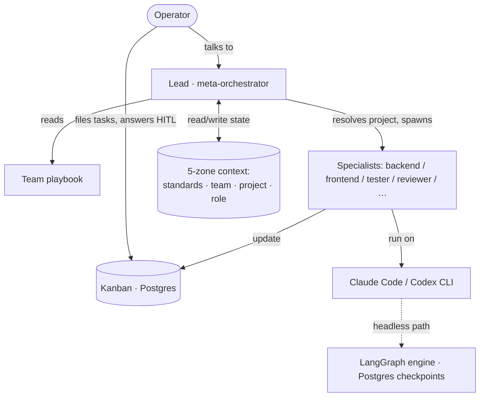

# agent-teams

**A self-hosted orchestration and governance layer that turns an agentic coding CLI — Claude Code or OpenAI Codex — into a persistent, governed, multi-domain agent *team*.**

You're one person trying to move several things forward at once. The coding agent that was razor-sharp an hour ago is now drifting — its one long session has piled up and mixed context until you're re-explaining what you already said, babysitting each run, and carrying every open thread in your head. A single coding CLI is a powerful brain with no memory across sessions, no project state, no team structure, and no safety rails. agent-teams is the layer that closes that gap: a Postgres-backed Kanban that remembers the plan so you don't have to, a meta-orchestrator that spawns a fresh domain specialist per task, a five-zone context model, and a defense-in-depth safety system. File the queue, step away, and trust it's handled — the leverage of a whole team, without the burnout of being one. Everything runs on your machine in Docker. No cloud sign-up, no SaaS subscription, no code leaving your network.

It is also **dogfooded**: agent-teams is built *by* agent-teams. The repo's own commit history and Kanban are the system managing its own development.

---

## Why it's different

Claude Code already gives you sub-agents, and you can keep several sessions open. agent-teams is the layer that makes that raw power actually land — every task a clean, scoped contract instead of one sprawling chat you keep having to wrangle.

| | Self-hosted | Persistent task/project state | Beyond code | Governance/safety layer | Form |
|---|:--:|:--:|:--:|:--:|---|
| Cloud SWE agents (Devin, Cursor, Windsurf) | ✗ | ✗ session/codebase | ✗ code-only | black-box | product / IDE |
| AI assistant (GitHub Copilot) | ✗ | ✗ chat-scoped | ✗ code-only | black-box | product |
| Agent frameworks (CrewAI, AutoGen, LangGraph) | ✓ lib | ✗ you build it | ✓ DIY | ✗ you build it | library |
| Self-hosted platform (OpenHands) | ✓ | ~ less structured | ~ dev-focused | local isolation | product / SDK |
| **agent-teams** | ✓ | ✓ Postgres Kanban + 5-zone context | ✓ team playbooks (dev/content/SEO/…) | ✓ defense-in-depth + AC + HITL + cost | **layer on Claude Code / Codex** |

The gap it fills: a **self-hosted, persistent, governed, multi-domain orchestration layer** — the cloud agents and IDEs aren't self-hosted or persistent, and the frameworks hand you a toolbox and a weekend of plumbing. This is the part you'd otherwise build yourself, at night, instead of shipping: the state, the governance, and the team structure, already wired.

---

## What's genuinely special

- **Batch & parallel execution without context rot.** This is the headline, and it's the part that buys back your evening. You queue many tasks ahead of time and run them continuously, back-to-back — and/or in parallel across independent role lanes — hands-off. The trick: each task spawns its *own* fresh specialist agent with a scoped brief and only the relevant context zones, instead of growing one ever-larger conversation. So per-task context stays bounded, and a long run of dozens of tasks never accumulates the cross-task mixing and drift a single marathon session suffers. The board holds the plan, so you don't carry the to-do list in your head — you file the queue, close the laptop, and let it run while you sleep. It's how one operator sustains several projects at once without the babysitting. (This is literally how this repo is built — see the dogfooding note below.)

- **Tasks as precise contracts.** A vague prompt earns a vague result, and then you're re-prompting. Work here is broken into Kanban tasks carrying rich detail plus **acceptance-criteria gates** — a structured spec, so output lands right the first time and you state the goal once instead of micro-managing wording. A task isn't "done" until each AC is checked against a real source. The same contract layer carries the governance teeth: human-in-the-loop gates, hard cost guardrails (daily/monthly budget caps enforced at task-creation, returning `429` with a spend projection before an over-budget task spawns), and a full audit trail in `tasks_history`.

- **Meta-orchestrator + team playbooks.** A "Lead" agent resolves the active project, loads that project's team playbook, and spawns the right domain specialists for the work. **7 teams** (dev, novel, general, content, SEO, data-analytics, SEM) and **~37 specialist agent definitions** live in `.claude/agents/`, each with a scoped lane and permission model.

- **Persistent state + 5-zone context architecture.** A PostgreSQL-backed Kanban (projects / tasks / history) plus a five-zone storage model — **DB, standards, team-methodology, project-shared, role-state** — that survives sessions and gives each spawned agent its bounded, relevant slice. Each zone has an explicit writer and read scope. (See "Storage architecture" in [CLAUDE.md](CLAUDE.md).) Prompt-caching of the stable specialist context measured a **77.5% input-cost reduction** on a 10-iteration scenario.

- **Incident-driven defense-in-depth.** Born from a real dev-DB-wipe postmortem (2026-05-17): **21 prevention layers** span the database, API, LangGraph engine, and CLI hooks — Postgres role-level gates on destructive SQL, a migration target guard (`MIGRATION_TARGET`), a seed target guard (`SEED_TARGET`), payload size caps, agent-context sanitization, an LLM safety prelude prepended to every prompt, a pre-push secret/keyword scan, and soft-delete + audit triggers. Each layer carries verification evidence in the incident record.

- **Dogfooded.** This isn't a slideshow. agent-teams develops agent-teams, running as exactly the continuous task batches described above — the orchestration, Kanban, and governance you're reading about are the same ones that managed building them. The repo's commit and task history is the proof, in public.

---

## What it is — and isn't

**It is:** an orchestration + governance layer on top of an agentic coding CLI. It works today via **Claude Code** (the live execution brain) and **OpenAI Codex**.

**It isn't:**
- a frontier autonomous SWE agent like **Devin** — it orchestrates a coding agent, it doesn't *be* one;
- an IDE like **Cursor** or **Windsurf** — there's no editor; you keep your own;
- a from-scratch agent framework like **CrewAI** / **AutoGen** / **LangGraph** — in fact it *uses* LangGraph for its headless engine rather than reinventing one.

And in the interest of an honest reviewer's read: the **headless autonomous engine is in active development**. Today the execution brain is the Claude Code / Codex CLI driven interactively (with per-action approval), while the `langgraph` service runs tasks through a supervisor → specialist graph with Postgres-checkpointed state. The interactive path is the production path right now.

---

## Architecture at a glance

The Lead reads the team playbook, resolves which project the session is bound to, and spawns specialists. Specialists run on the coding CLI and persist their work to the Kanban and the five context zones.

---

## CLI-agnostic by design

The orchestration runs on agentic coding CLIs — **Claude Code and OpenAI Codex** — because the rules live in portable instruction files: [`CLAUDE.md`](CLAUDE.md) for Claude Code and [`AGENTS.md`](AGENTS.md) for Codex. The same governance, lanes, and team structure apply regardless of which CLI drives them. This is a deliberate vendor-portable design: you aren't locked to one coding-agent vendor.

---

## Get started

1. Install [Docker Desktop](https://www.docker.com/products/docker-desktop/) and restart your computer.
2. Open a terminal **in this folder** and run the installer:
   - **macOS / Linux / WSL:** `./bin/install.sh`
   - **Windows (PowerShell):** `.\bin\install.ps1` (if scripts are blocked, run `Set-ExecutionPolicy -Scope CurrentUser RemoteSigned` once first)
3. Open **http://localhost:5431** — your Kanban board (the installer seeds a `demo-tour` project to explore). Create, queue, and track tasks here, and answer agents' questions as they come up. Two ways to put agents to work:

   - **3.1 — From a Claude Code or Codex session (works today).** Open this repo in Claude Code or OpenAI Codex; the Lead resolves your project, loads its team playbook, and orchestrates the specialists end-to-end. This is the production path right now. → see **[CLAUDE-CODE-START.md](CLAUDE-CODE-START.md)**.
   - **3.2 — One-click "Start" on the board *(under development)*.** Flipping a task to auto-run hands it to the headless `langgraph` engine so it runs with no terminal open. This path is **in active development** (the specialist execution is text-only today) — see the "What it is — and isn't" section above.

The installer is safe to re-run; the services keep running after you close the terminal.

**Multi-provider, local-first.** Models are switchable via one `.env` variable (`LANGGRAPH_LLM_PROVIDER`): **Anthropic** (default), **OpenAI**, or **Ollama** for fully local inference with no API key and no network egress. Your code is never stored by any provider; with Ollama it never leaves your machine.

**Stop / reset:** `docker compose down` to stop; `.\bin\reset.ps1` (or `./bin/reset.sh`) to wipe and start fresh.

---

## Learn more

The companion docs go deep so this README stays scannable:

- **[QUICKSTART.md](QUICKSTART.md)** — 5-minute tour via the browser UI.
- **[CLAUDE-CODE-START.md](CLAUDE-CODE-START.md)** — driving the team from a Claude Code terminal session.
- **[USAGE-POWER.md](USAGE-POWER.md)** — parallel agents, auto-mode, multi-project workflows, mobile remote access.
- **[readme_dev.md](readme_dev.md)** — architecture deep-dive: storage zones, team rosters, configuration, and customization.

For the full development history, read the git log and the Kanban it produced — that's the dogfooding in action.
