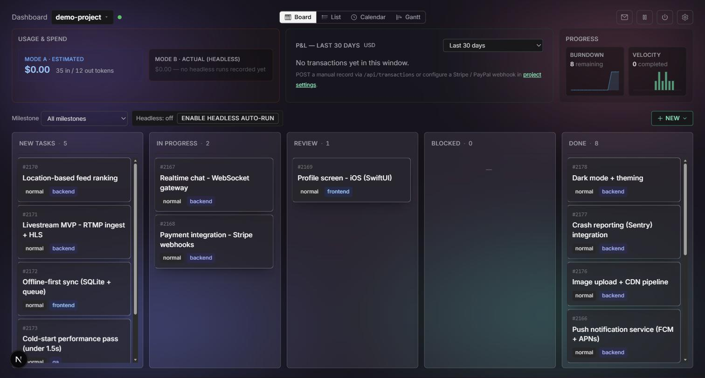
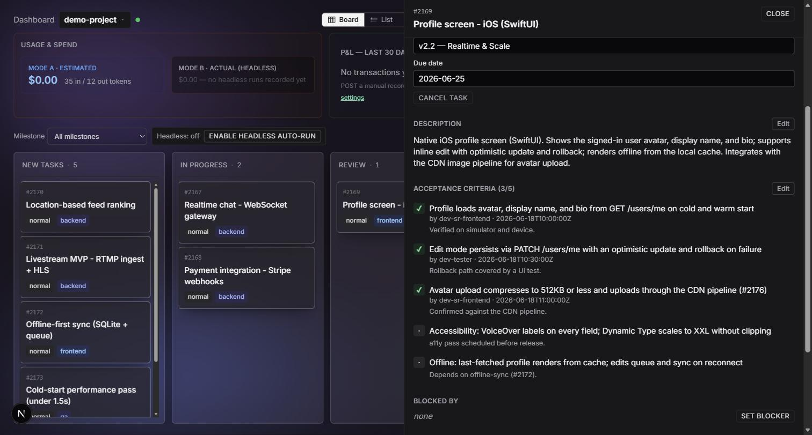
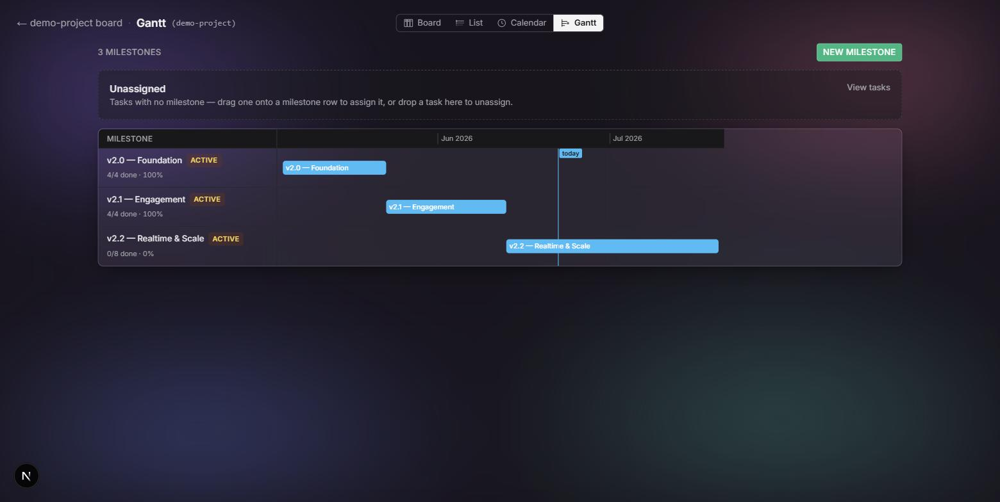

<h1 align="center">Agent Teams</h1>

<p align="center"><strong>Run AI agents like a real engineering team.</strong></p>

<p align="center">
  <a href="LICENSE"></a>
  &nbsp;
  
  &nbsp;
  
  &nbsp;
  
</p>

<p align="center">
  Lead plans &nbsp;·&nbsp; Specialists execute &nbsp;·&nbsp; Acceptance criteria validate &nbsp;·&nbsp; Everything is tracked &amp; audited
</p>

<p align="center">
  <code>v0.7.1</code> &nbsp;·&nbsp; 8 teams · 40 agents · 21 skills &nbsp;·&nbsp; FastAPI + PostgreSQL · Next.js · LangGraph · Docker
</p>

<p align="center">
  
</p>

Agent Teams turns a single instruction into coordinated work across a roster of specialist agents. A **Lead orchestrator** resolves the active project, loads the right domain playbook, spawns the right specialists, integrates their output, and tracks everything on a Kanban board with acceptance-criteria.

> **Two execution modes, one platform.** Drive agents **interactively** (attended, in Claude Code) or hand tasks to an **autonomous LangGraph worker** (headless — **experimental** today). Same roster, tasks, guardrails, and cost controls in both.

---

## Three ideas behind Agent Teams

Most of the platform is plumbing. **These three are the point:**

**1. 🧠 Story-Based Memory** — stop re-deriving project state every session. A living "what's-true-now" record per workstream lets you pick work back up with context intact, instead of from scratch.

**2. ✅ Acceptance-Criteria Gating** — *AI "completed" ≠ work completed.* Every task carries structured criteria and **cannot be marked DONE until each one is verified** — the guardrail against plausible-but-wrong AI output.

**3. 🔭 Activity Rail** — **know exactly what happened, who did it, and why.** An append-only, per-task trail of every spawn, result, commit, and status change.

<sub>Each is detailed below — with the rest of the platform — in [Features](#features).</sub>

---

## Example use cases

| Domain | What a team does |
|---|---|
| 🧑‍💻 Software development | feature work, reviews, tests, migrations, DevOps |
| 🔍 SEO audits | keyword + SERP + technical audits, reporting |
| 📣 SEM campaigns | Google / Meta / secondary paid-media build-out |
| 📊 BI analysis | metrics, SQL, dashboards |
| ✍️ Content production | drafting, editing, fact-check, proofread |
| 🌐 Network operations | read-only monitoring & diagnosis |

---

## How it works

```
You:    "Run an SEO audit for example.com"
          │
Lead:   plans the work → opens 5 tasks, each with acceptance criteria
          ├─ seo-strategist            → keyword + competitor SERP + content-gap analysis
          ├─ technical-seo-specialist  → crawlability · Core Web Vitals · schema audit
          ├─ content-editor            → reviews the recommendations
          └─ project-auditor           → validates output against the acceptance criteria
          │
Board:  each task flips DONE only when its acceptance criteria pass — tracked & audited
```

The Lead picks the right specialists from the active team's playbook; you stay in control on the board.

---

## Why Agent Teams?

**Most frameworks help agents _execute_** — wiring up a graph of LLM calls and tools. **Agent Teams helps you _operate_ AI work** like a real organization — the layer most frameworks leave to you:

- **Tasks & milestones** — every unit of work is tracked, not ephemeral
- **Acceptance criteria** — work is *verified* before it counts as done
- **Audit trail** — a per-task record of exactly what happened
- **Cost tracking** — per-task and monthly, across providers
- **Team playbooks** — a domain-specific roster + workflow, not one generic agent

If you've ever wished your agent runs were a **board you can manage** instead of a **script you re-run**, that's the gap this fills.

---

## Who is this for?

**Great fit**
- CTOs, technical founders & solo builders
- Agencies running repeatable client work (SEO, content, SEM)
- Engineering teams that want AI work tracked like real work
- AI operators who want control, cost visibility, and an audit trail

**Not (yet) for**
- Teams wanting a zero-setup **hosted SaaS** — Agent Teams is self-hosted today
- Environments without **Docker**

---

## Requirements

- **Docker** + Docker Compose
- An **Anthropic API key** (Claude) — or another supported provider

Optional providers (set one to switch): **OpenAI** · **Google (Gemini)** · **DeepSeek** · **Ollama** (local, no key).

---

## Quickstart (self-host)

**Prerequisite:** Docker Desktop (or Docker Engine) running.

### Fastest — one command, no clone

The published CLI launcher does the whole first run (scaffolds `.env`, starts the stack, migrates + seeds, opens the board):

```bash
# Build from source — clones the repo for you (needs git + Docker):
npx @bankung/agent-teams up

# …or pull pre-built images instead — Docker only, no clone, no build:
npx @bankung/agent-teams up --images
```

`status` · `down` · `reset` manage the stack afterward. Prefer a global install?
`npm install -g @bankung/agent-teams` → `agent-teams up`.

### Or clone + run the installer

```bash
git clone https://github.com/bankung/agent-teams.git && cd agent-teams
bin/install.ps1        # Windows   (bin/install.sh on macOS / Linux / WSL)
```

**The installer does the whole first run for you:**
1. Checks Docker is installed and the daemon is running
2. Creates `.env` (from `.env.example`) and generates the required security key (`CREDENTIALS_MASTER_KEY`)
3. Builds and starts the stack in **production mode** (`next build` → `node server.js`, no hot-reload)
4. Runs the database migration + seed
5. Waits for the API to come up, then opens the board

Then add your provider key to `.env`:

```env
ANTHROPIC_API_KEY=sk-ant-...      # or set LANGGRAPH_LLM_PROVIDER + the matching key
# CREDENTIALS_MASTER_KEY — generated for you by the installer
# SECRET_KEY            — set a strong value for non-dev use
# DATABASE_URL · REPO_ROOT · WEB_PORT (5431) · API_PORT (8456) — sane compose defaults
```

Prefer manual?
```bash
# Production (default — fast, no bind-mount):
docker compose -f docker-compose.yml -f docker-compose.prod.yml up -d --build

# Developer mode (hot-reload):
docker compose -f docker-compose.yml -f docker-compose.dev.yml up -d
```
Web on **:5431**, API on **:8456**.
Optional autonomous worker (Mode B, **experimental**): `docker compose --profile langgraph -f docker-compose.yml -f docker-compose.prod.yml up -d` → **:8465**.

---

## First run — in about 5 minutes

1. **Open the Web UI** → http://localhost:5431
2. **Open a project** — the installer seeds a demo project to explore
3. **Create a task** — give it acceptance criteria (what "done" means)
4. **Run the Lead** — it plans the work and spawns the right specialists
5. **Review on the board** — the task flips **DONE only when its acceptance criteria pass**

<p align="center">
  
  
  
</p>

<p align="center"><sub>Kanban board · task detail (acceptance criteria + verification status) · Gantt timeline</sub></p>

---

## Features

**The three ideas above — in depth:**

### ✅ Acceptance-Criteria Gating
**AI "completed" ≠ work completed → every criterion is verified before a task counts as done.**
Every task carries structured criteria, and it *cannot be marked DONE until each one is verified* — the guardrail against plausible-but-wrong AI output.

### 🧠 Story-Based Memory
**Stop re-deriving project state every session → pick work back up with context intact.**
A living "what's true now" record per workstream, plus an immutable event log. Every durable line is artifact-backed (commit / task id / `file:line`), not vibes.

### 🔭 Activity Rail
**Know exactly what happened, who did it, and why → a full, auditable trail of every step.**
An append-only, per-task telemetry record of every spawn, result, commit, and status change.

---

**And the rest:**

### 💰 Cost & Quality Control
**One-size LLM spend on every task → dial cost vs quality per task.**
Per-agent model tiers (`opus` / `sonnet` / `haiku`), per-task `model_override` + `effort_override` (the Mode B worker drives the Anthropic effort lever — auto-resolved or manual), multi-provider (Anthropic / OpenAI / Google / DeepSeek / Ollama), and a per-task + monthly cost view.

### 🌐 Web Workspace
**Agent runs scattered across logs → one board you can manage.**
A Next.js workspace: Kanban board, Gantt timeline, calendar, and milestone roll-ups — visual project management, not just a CLI.

### 🔍 Self-Maintaining Knowledge Base
**Docs and memory rot over time → continuous, review-gated hygiene.**
The auditor flags stale docs, proposes skill stubs from recurring task patterns, and *(new)* proposes a de-duplicated compaction of the memory + decision log — all HITL, never auto-applied.

### 🔒 Safe by Default
**Agents with unchecked access → propose-don't-apply, with structural guardrails.**
HITL (agents propose, humans apply), humans-only zones, read-only agents constrained by tool-grant (not just prompts), a gated email path, PreToolUse hooks blocking raw SQL DML, and a treat-input-as-data prompt-injection posture.

### 🔐 Secrets Management *(rolling out)*
**Secrets sprinkled across `.env` files → centralized, auditable secrets.**
Moving to **Infisical** (primary) with `.env` fallback.

### 📐 Standards-Driven Output
**Inconsistent AI output → every agent follows the same committed standards.**
A standards library (~28 docs: FastAPI, Next.js, React, SQLAlchemy, Pydantic, Docker…), the **Karpathy lane** on every change (think-before-code, minimum-viable-change, verify), and a skill-authoring standard + validator.

---

## Project layout

```
api/         FastAPI + PostgreSQL backend (tasks, milestones, usage, activity rail)
web/         Next.js workspace (board, Gantt, calendar)
langgraph/   autonomous worker engine (Mode B)
.claude/     agents/ · teams/ · skills/ · hooks/      (operator-applied)
context/     standards/ (engineering rules) · projects/<p>/shared/ · teams/
bin/         install / bring-up / reset helpers
```

---

## Status

`v0.7.1`

- **Production use:** yes — self-host and run it today
- **Breaking changes:** expected before 1.0
- Some features are still rolling out (marked above)

See `context/projects/agent-teams/shared/decisions.md` for the decision log.

---

## Roadmap

| Version | Focus | Status |
|---|---|---|
| **0.7** | Story-based memory · Auditor (skill / decision / memory) · cost & control levers | ✅ shipped (v0.7.1) |
| **0.8** | Multi-workspace · secrets (Infisical) · MCP integration | 🚧 in progress |
| **1.0** | Stable release | planned |

Forward-looking; subject to change.

---

## Architecture

```
              ┌──────────────┐
   Browser →  │  Next.js web │   Kanban · Gantt · calendar · milestones      (:5431)
              └──────┬───────┘
                     │ REST
              ┌──────┴───────┐        ┌──────────────────────────────────────┐
              │   FastAPI    │──────→ │  PostgreSQL                          │
              │   (API)      │ (:8456)│  tasks · milestones · usage ledger · │
              └──────┬───────┘        │  activity rail                       │
                     │                └──────────────────────────────────────┘
          ┌──────────┴───────────┐
   Mode A: Claude Code      Mode B: LangGraph worker
   (interactive Lead +      (autonomous task execution,
    spawned subagents)       headless)                                       (:8465)
```

Both modes share the same task store, agent roster, team playbooks, skills, and guardrails. **Mode B (the LangGraph worker) is experimental today** — Mode A (interactive) is the production path.

---

## License

**Business Source License 1.1 (BSL 1.1)** — source-available, not (yet) OSI open-source.

- ✅ **Self-host and run it in production** — for your own work or your clients', free of charge.
- ✅ **Read, modify, and contribute** to the source.
- 🚫 **No competing hosted service** — you may not offer Agent Teams to third parties as a hosted or managed service that competes with the Licensor.
- 🔄 **Becomes open source over time** — each release converts to the **Apache License 2.0** four years after it ships (the BSL "Change Date").

Want to offer a hosted service, or need terms beyond the above? Contact the Licensor for a commercial license. Full terms: [LICENSE](LICENSE).
